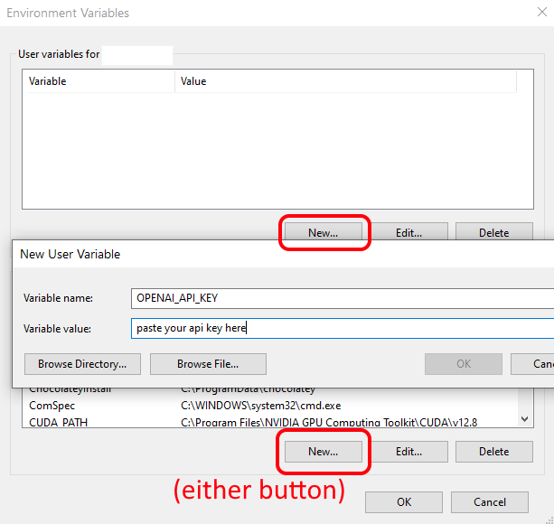

### API Key Security

Generally, locally hosted LLMs need no API key. `api_key: ""`

For cloud APIs, I recommend using environment variables for your api keys:

1. Set environment variable: 

    a. `set OPENAI_API_KEY=your_key_here` (Windows) 

    b. `export OPENAI_API_KEY=your_key_here` (POSIX)

2. Reference it in `config.yaml`: `api_key: "OPENAI_API_KEY"`

You can also set environment variable permanently in the Windows Environment Variables GUI.  

I will assume Linux users know what they're doing to configure an env var.

The value of `api_key` will be used literally if it is not a value listed under `api_key_env_vars`.  

3. `api_key: "asdfqwerty1234567890foobarbazqux"`

However, using an environment variable is generally preferred.