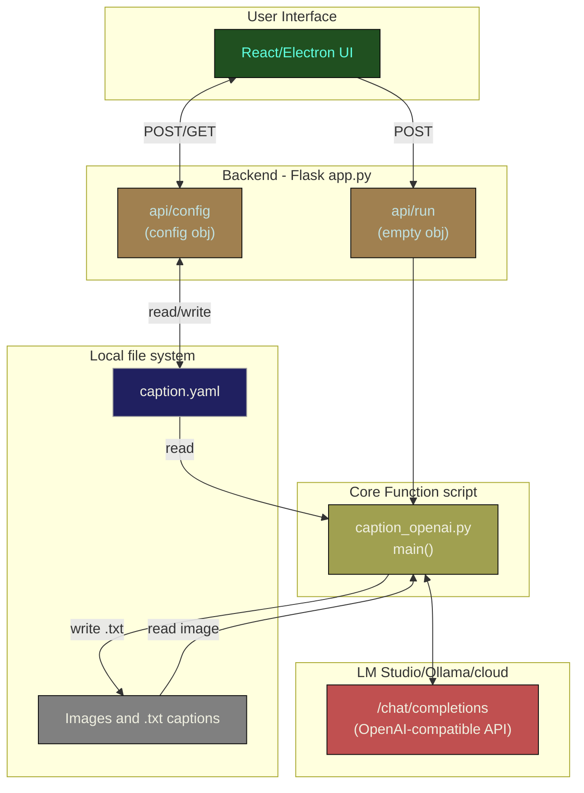

# Dev

## Basic app layout

You'll need to install a Mermaid preview extension in VS Code to view this. 

### Explanation

The UI uses the flask API to read/write `caption.yaml` on disk for configuration. Then when `run caption` is triggered in the UI, it calls the flash API `api/run` with an empty object which in turn calls the `main()` function in  `caption_openai.py`. `main()` reads the `caption.yaml` configuration and executes the core functionality.

`caption_openai.py main()` loops over all the images in the configured directory and calls the external (to this app) hosted OpenAI-compatible API to retrieve chat completions for each prompt, then writes the final captionn on disk in .txt next to each image.

## Setup and run

Setup your venv and install requirements.

    python -m venv venv
    # activate (Windows)
    .\venv\Scripts\activate.bat
    # activate (posix)
    source venv\bin\activate
    # install requirements
    pip install -r requirements.txt

To run the entire app:
    
    cd ui
    npm run electron-dev

This should launch the app with web debugger so you can live-edit the react app.  It will also launch the backend api (app.py), but the api will require a restart for changes.

You can launch on just the api if you want.

    python app.py

The api will try to get port 5000 or the next available port thereafter, and coordinate with the react front end what port it chose.

Or, you can run just the core script which immediately reads the configuration from `caption.yaml` and executes the core functionality.

    python caption_openai.py

For development, the `caption.yaml` will be the one in the root of this git repo.

When built via the github action and installed on Windows via the installer, the app will be installed to `c:\users\[yourusername]\AppData\...` and that is where `caption.yaml` lives and will be modified. Users should not need to manually modify the caption.yaml.

### Tips

Watch what port is captured for the flask api when the application is started.  It will try to get port 5000 or increment if not available.  If it gets 5001+ it may mean another instance of the api is still running and needs to be killed manually.