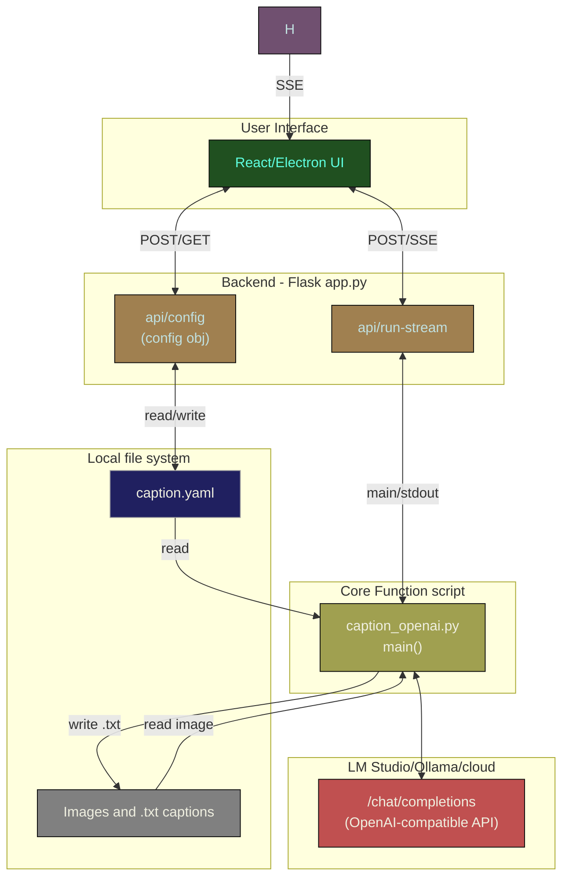

# Dev

[Contributing](Contributing)

[Basic app layout](Basic_app_layout)

[Setup and run](Setup_and_run)

[Tips](Tips)

## Contributing

Contributions are welcome.

The goal is to keep the application relatively lightweight and include features that are broadly applicable to the task of bulk automation of image captioning, so adding packages like pytorch and very narrow or hard-coded implementations should be avoided.

Any configuration items added to `caption.yaml` should be coded to handle missing items safely and with backwards compatibility in mind when possible.  

Please bring up any breaking changes in your PR comments.

Examples of good PRs:
- Add optional parquet output option (instead of or optional with) existing .txt saving.
- Add a hint source that sources data using a sqllite client, with a generalized query builder, configuration options, or at least coded in an extensible way.
- Bug fixes that do not break existing functionality.

PRs that might raise an eyebrow:
- Add a hint source with hard-coded queries specific to your environment (please abstract, add configuration options, or make it extensible).
- Anything that adds pytorch (too big!)
- Change the output from .txt to a single .json and break the existing functionality.

Before creating a PR consider:
- Does this change increase the app release size substantially? 
- Is this change something others might find useful?
- Does all current functionality still work?
- Did you test the application?
- Did you check that changing any new configuration items properly saves them to `caption.yaml` on disk?
- Did you review the outputs (.txt files) for a few test images to make sure they still look sane?

### Commits and Release Notes

Please include meaningful commit messages as they are captured in the changelog for releases. 

## Basic app layout

You'll need to install a Mermaid preview extension in VS Code to view this.  This graph not 100% complete, but includes critical components and data flow.

### Explanation

The UI uses the flask API to read/write `caption.yaml` on disk for configuration. Then when `Run Captioning` is clicked in the UI, it calls the flash API `api/run-stream` with an empty object which in turn calls the `main()` function in  `caption_openai.py`. `main()` reads the `caption.yaml` configuration from disk and executes the core functionality.  Server-side events stream the console output back to the UI.

`caption_openai.py main()` loops over all the images in the configured directory and calls the external (to this app) hosted OpenAI-compatible API to retrieve chat completions for each prompt, then writes the final captionn on disk in .txt next to each image.

## Setup and run

Setup your venv and install requirements.

    python -m venv venv
    # activate (Windows)
    .\venv\Scripts\activate.bat
    # activate (posix)
    source venv\bin\activate
    # install requirements
    pip install -r requirements.txt

To run the entire app:
    
    cd ui
    npm install # one time or to update packages
    npm run electron-dev

This should launch the app with web debugger so you can live-edit the react app.  It will also launch the backend api (app.py), but the api will require a restart for changes.

You can launch on just the api if you want.

    python app.py

The api will try to get port 5000 or the next available port thereafter, and coordinate with the react front end what port it chose.

Or, you can run just the core script which immediately reads the configuration from `caption.yaml` and executes the core functionality.

    python caption_openai.py

For development, the `caption.yaml` will be the one in the root of this git repo.  

When built via the github action and installed on Windows via the installer, the app will be installed to `c:\users\[yourusername]\AppData\...` and that is where `caption.yaml` lives and will be modified. GUI users should not need to manually modify `caption.yaml`.

### Tips

Watch what port is captured for the flask api when the application is started.  It will try to get port 5000 or increment if not available.  If it gets 5001+ it may mean another instance of the api is still running and needs to be killed manually.  The app should attempt a shutdown of the API if you close the app, but its possible for that process to fail.

