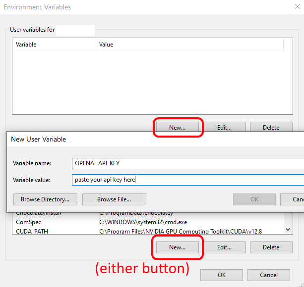

# VLM Image Captioning Tool

A Python script that uses Vision Language Models (VLMs) to generate detailed captions for images through multi-turn conversations with AI models with any VLM via an "OpenAI-compatible" API.

## Features

- **Multi-turn Conversations**: Configure a series of prompts to guide the VLM through detailed image analysis
- **Multiple API Support**: Compatible with most common local/offline LLM servers, OpenAI, Anthropic, Google Gemini, etc.
- **Global Metadata**: Optionally include character databases or other reference material in system prompts
- **Hint Sources**: Optionally include additional per-image metadata (file paths, folder metadata.json, etc.) in prompts on a per-image basis, with easy developer extension
- **Bulk Processing**: Process entire directories of images
- **Output**: Saves captions as .txt files alongside original images

## Installation

### Requirements

- Python 3.7+
- For Windows:
    ```shell
    git clone https://www.github.com/victorchall/vlm-caption
    cd vlm-caption
    python -m venv venv
    .\venv\Scripts\activate.bat
    pip install pillow openai omegaconf aiofiles
    ```
- For posix:
    ```shell
    git clone https://www.github.com/victorchall/vlm-caption
    cd vlm-caption
    python -m venv venv
    source venv/bin/activate
    pip install pillow openai omegaconf aiofiles
    ```

## Configuration

All settings are configured through `caption.yaml`. Here's a breakdown of the key configuration sections:

### API Configuration

```yaml
# API endpoint - can be local LLM server or cloud service
base_url: "http://localhost:1234/v1"
# base_url: "https://api.openai.com/v1"
# base_url: "https://api.anthropic.com/v1"

# API key handling
api_key: ""  # Leave empty for local servers
# api_key: "OPENAI_API_KEY"  # Use env var name for cloud APIs

# Model selection
model: "gemma-3-27b-it"
# model: "gpt-4o-mini"
# model: "claude-sonnet-4-20250514"

# Token limit (adjust for local VRAM constraints)
max_tokens: 16384
```


### Prompt Configuration

**System Prompt**: Base instructions for the VLM.  Think of this as a global instruction that you likely will not modify per project.
```yaml
system_prompt: "You are to analyze an image and provide information based on what is visible in the image. Do not embellish, preferring to focus on factual information."
```

**Global Metadata**: Optional file to include additional context (e.g., character databases)
```yaml
global_metadata_file: "character_info.txt"
```

**Multi-turn Prompts**: Sequential questions asked to the VLM
```yaml
prompts:
  - "What character(s) do you think are present? Support your decision based on physical features."
  - "What other objects are present in the image? What is the general scene?"
  - "Describe their outfits in detail."
  - "Describe the general composition from a photographer's perspective."
  - "Can you categorize the artistic style or medium?"
  - "Summarize the description in four sentences. No markdown or special formatting."
```

The **final prompt's response** becomes the saved caption.

### Hint Sources

Enable additional context sources that get prepended to the first prompt. 

```yaml
hint_sources:
  - "full_path"  # Includes file path information
```

See [HINTSOURCES.md](HINTSOURCES.md) for details on available hint sources.

### Directory Processing

```yaml
base_directory: "C:/path/to/images"  # Root directory to process
# base_directory: "/mnt/path/to/images"  # POSIX style path
recursive: false  # Enable recursive subdirectory processing
```

### API Key Security

Generally, locally hosted LLMs need no API key. `api_key: ""`

For cloud APIs, I recommend using environment variables for your api keys:

1. Set environment variable: 

    a. `set OPENAI_API_KEY=your_key_here` (Windows) 

    b. `export OPENAI_API_KEY=your_key_here` (POSIX)

2. Reference it in `config.yaml`: `api_key: "OPENAI_API_KEY"`

You can also set environment variable permanently in the Windows Environment Variables GUI.  

I will assume Linux users know what they're doing to configure an env var.

The value of `api_key` will be used literally if it is not a value listed under `api_key_env_vars`.  

3. `api_key: "asdfqwerty1234567890foobarbazqux"`

However, using an environment variable is generally preferred.

## Usage

1. **Configure** your settings in `caption.yaml`
2. **Run** the script:
   ```bash
   python caption_openai.py
   ```

The script will:
- Process all images in the specified directory
- Send each image through the configured prompt sequence, sending the full chat history on each request
- Save the final response as `[filename].txt` alongside each image
- Generate debug chat history files (`chat_history[n].txt`, etc.) in the script folder *for the most recent processed image only*, useful for debugging.


## Local VLM/LLM server pre-configuration

1. Install one of the following: [LM Studio](https://lmstudio.ai/download), [vllm](https://github.com/vllm-project/vllm), [ollama](https://ollama.com/download), or any other local LLM service that serves via the "OpenAI API" (most of them do). 
    
    LM Studio is likely the easiest for most people to get working since it is entirely GUI based. I've only included extra steps below for LM Studio. If you want to use ollama, vllm, or another service, please refer to that applications documentation.

2. Pull your preferred model inside the service you installed in step 1. You should select a model and quant that is a few gigabytes less than your VRAM to leave room for context.
    
    a. For LM Studio, open the app and go to Discover, search for models and download one. 

3. Make sure local hosting is enabled:
   
    a. For LM Studio, enable developer mode (bottom left  `User - Power User - Developer`, click on `Developer`), then go to the Developer section at the top left to enable the service. Make sure to copy the uri shown at the top right.
    
    


4. Make sure the service works.  You can typically check the /v1/models route in any web browser to make sure the service is running and models are available to serve. (ex. something like `http://192.168.0.5:11434/v1/models` or `http://localhost:1234/v1/models`)

5.  Paste the IP and port and paste into `caption.yaml` in the `base_url` value, and add `/v1`.  You may also see `localhost` in place of the IP if you are not configured to host to the rest of your local network.
    


Congrats! You're running your own offline LLM/VLM server. 

*Check the documentation for the server/app you are using if you need more information or support on configuring your service. Further info for LM Studio is [here](https://lmstudio.ai/docs/app/api)*

## Tips

- **Prompt Tuning**: Experiment with different prompt sequences for better results. The example prompt chain included should give you some good ideas. Note that 1 to 5 is generally sufficient, and too many may lead to worse outcomes depending on the model used.
- **Presort Data**: Sort your data into subdirectories ahead of time with directory names that might help steer the model, such as `c:/cloud strife` `c:/rufus shinra/`, then use the `full_path` hint_source. 
- **Utilize metadata**: Try writing a text file with details of the overall "universe" of your image data and reference the txt file with `global_metadata_file` in `caption.yaml`, for example `global_metadata_file: "character_info.txt"`

- **Model Selection**: Different models may excel at different types of image analysis. 
    
    If you have a >=24GB GPU, I highly recommend Gemma 27B (`gemma-3-27b-it`).  Q4_K_M is about 19.5GB, leaving ~4GB for context and kv caching which is typically sufficient. If you have 32GB or more, use a larger quantization (Q5_K_M, Q8_0, etc). 

    InternVL3-14B is a good alternative smaller model for users with 16GB or less. 

    Not all models are suitable for multi-turn conversation. Try different models, or you can try a single prompt.
- **Cuda OOM or Falures**: You may need to reduce the number of prompts in your chain if you run out of VRAM, or select a smaller quantization of the model (Q3_K_S, etc), or select a smaller model. You may also need to configure your service to increase the context size as the default is often 4096, which you could exceed with very long chains of prompts, leading to unintended outputs depending on how the service truncates. Check your service logs to spot errors. Refer to the documentation of the service to change the configuration.

## Advanced tip

- **Metadata collection**: Adding context is **incredibly powerful**. Think ahead when you decide to collect a new set of data and how you can capture other metadata. 

    For instance, if you are writing webscrapers, make sure to collect metadata from the webpage as you go rather than blindly just download each image. Perhaps you might include the website address or full URI, the `<title>` tag from the webpage, the `alt-text`, etc. Save this information with each image, or in a database. Then feed into the VLM with a `hint_source`. New hint sources are very easy for an amateur Python programmer to write, or you can have an LLM write for you. 

    See [HINTSOURCES.md](HINTSOURCES.md) for more information.