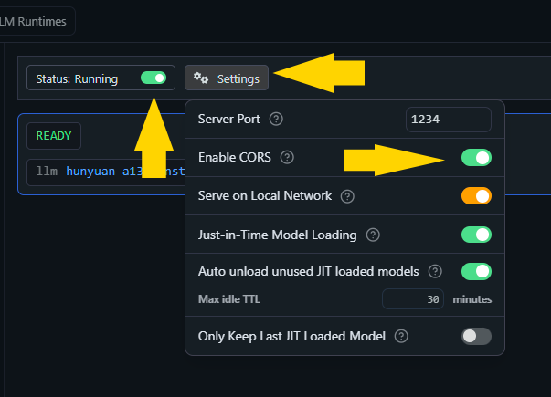

# VLM Image Captioning Tool
<p align="center">
  
</p>

This app uses Vision Language Models (VLM) to generate detailed captions for images through multi-turn conversations, using a separately hosted VLM models via an "OpenAI-compatible" API (*including locally hosted models*).

This is currently "beta" and features may change.

A common use case would be to automate captioning large numbers of images for later text-to-image diffusion model training or classification tasks.

Slightly old video, app overview with install: [VLM Caption, multi-turn, data-driven image captioning](https://www.youtube.com/watch?v=WZ6zK7Tc0zs)

## Install

- See [API Service Setup](#API_Service_Setup) to install a VLM/LLM server of your choice.  LM Studio is extremely easy to install and use to manage models.  Your API service will actually host your VLM/LLM models, and any model you can load can be used, but `Vision` support is required. Many hundreds, if not thousands of models are available.

- Visit https://github.com/victorchall/vlm-caption/releases click on `Assets` to expand the the download links.  You have two options to use the application.

    a. The cli (command line) app is just a zip file with  `caption.yaml`  and `caption_openai.exe`.  Unzip whereever you like. 
    - Edit the `caption.yaml` with the text editor of your choice then run the `caption_openai.exe`.

    Delete it to uninstall. To update, you can delete the old version or unzip it to the same location and overwrite. 
    
    b. The electron version is a GUI app delivered as a one-click installer that will give you a GUI to edit configurations instead of manually editing the caption.yaml file.  It will install and add a shortcut to your desktop.

    *You will need to Enable CORS on your VLM service. This is a simple toggle in LM Studio.*

    Uninstall via `Add or Remove programs` in Windows.  To update, just download a newer version and install again, it will overwrite the old version.


## Features

- **Multi-turn Conversations**: Configure a series of prompts to guide the VLM through detailed image analysis
- **Multiple API Support**: Compatible with most common local/offline LLM servers, OpenAI, Anthropic, Google Gemini, etc.
- **Global Metadata**: Optionally include character databases, location reference, or other material in system prompts
- **Hint Sources**: Optionally include additional per-image or per-directory metadata (file paths, folder metadata.json, {imagename}.json) in prompts on a per-image basis, with easy developer extension
- **Bulk Processing**: Process entire directories of images
- **Output**: Saves captions as .txt files alongside original images

The GUI is a simple wrapper to edit `caption.yaml` if you wish to just use CLI.

## Configuration

All settings are configured through `caption.yaml` when using the CLI version.  The GUI version has the same config, just presented in GUI form for ease.

**The Configuration file MUST be modified for your project and system.**

### API Configuration

Most of this is covered in [API Service Setup](#API_Service_Setup) for local users. If you are using a paid API, see [API_KEY.MD](API_KEY.MD) for info on setting your API.

### CLI 
If you just want to use the CLI, the entire app is driven by `caption.yaml`. Edit then run the CLI by running `python caption_openai.py`.  
```yaml
# API endpoint - can be local LLM server or cloud service
base_url: "http://localhost:1234/v1"
# base_url: "https://api.openai.com/v1"

# API key handling
api_key: ""  # Leave empty for local servers
# api_key: "OPENAI_API_KEY"  # Use env var name for cloud APIs

# Model selection
model: "gemma-3-27b-it"
# model: "gpt-4o-mini"
# model: "claude-sonnet-4-20250514"

max_tokens: 16384
```

**System Prompt**: Base instructions for the VLM.  Think of this as a global instruction that you likely will not modify per project.
```yaml
system_prompt: "You are to analyze an image and provide information based on what is visible in the image. Do not embellish, preferring to focus on factual information."
```

**Global Metadata**: Optional file to include additional context (e.g., character databases)
```yaml
global_metadata_file: "character_info.txt"
```

This is a great way to add a large text file with descriptions of all the locations, characters, and objects that might appear in any of the images to help the VLM identify things by their proper names instead of generic pronouns.

If you don't have this information, set it to empty quotes `""` like this:

```yaml
global_metadata_file: ""
```

See the example provided, `character_info.txt`, that includes detailed descriptions about the Final Fantasy VII Rebirth universe.  Keep in mind that very large documents will increase VRAM usage, but this is also a very useful feature to help aid the VLM identifying things like specific characters and locations by their proper names.  Otherwise, VLMs may not recognize specific things in the image unless they are very common on the internet.  I.e. A good VLM model will probably recognize Mario or Cloud Strife, but not some side character that is less popular.


**Multi-turn Prompts**: Sequential questions asked to the VLM
```yaml
prompts:
  - "What character(s) do you think are present? Support your decision based on physical features."
  - "What other objects are present in the image? What is the general scene?"
  - "Describe their outfits in detail."
  - "Describe the general composition from a photographer's perspective."
  - "Can you categorize the artistic style or medium?"
  - "Summarize the description in four sentences. No markdown or special formatting."
```

### Tips:

- The **final prompt's response** becomes the saved caption. I strongly recommend asking for a summary similar to the above example. 

- The more prompts you include the more VRAM and context will be required. 

- max_tokens may also be limited to the context length setting in your service. Check your service documentation for configuration.

- The above example is very strong when used with a more powerful VLM (like Gemma3 27B) and a large global metadata file with detailed descriptions.

- Experiment with small amounts of data to tweak your prompts.

## Hint Sources

Enable additional context sources that get prepended to the first prompt. 

```yaml
hint_sources:
  - full_path  # Includes file path information
  - json # tries to read a .json file of the same basename for each image
  - metadata # tries to read a metadata.json in the same folder as each image
```

You can add `#` to the beginning of the line to comment out ones you don't want. If a source isn't available for a given image, it is skipped.  For instances if you use `json` above and an image named `cloud_strife.jpeg` has no `cloud_strife.json` in the same directory, the hint is skipped.

See [HINTSOURCES.md](HINTSOURCES.md) for details on available hint sources and how they work. 

Developers can also add their own. PRs for generally useful hint_sources are welcome.

### Directory Processing

```yaml
base_directory: "C:/path/to/images"  # Root directory to process
# base_directory: "/mnt/path/to/images"  # POSIX style path
recursive: false  # Enable recursive subdirectory processing
```
Mostly self explanatory.  Paste in the path to the directory you want processed and set the recursive to `true` to walk all subdirectories.


## API Service Setup

You can use a paid API like OpenAI, Anthropic, or Google Gemini by configuring your [api_key](API_KEY.MD), however for local hosting, you'll need a service to host your VLM model.

1. Install one of the following: [LM Studio](https://lmstudio.ai/download), [vllm](https://github.com/vllm-project/vllm), [ollama](https://ollama.com/download), or any other local LLM service that serves via the "OpenAI API" (most of them do). 
    
    LM Studio is likely the easiest for most people to get working since it is entirely GUI based. I've only included extra steps below for LM Studio. If you want to use ollama, vllm, or another service, please refer to that application's documentation for installation. 

2. Download your preferred model inside the service you installed. You should select a model and quant that is a few gigabytes less than your VRAM to leave room for context.
    
    a. For LM Studio, open the app and go to Discover, search for models and download one. 

3. Make sure local hosting is enabled:
   
    a. For LM Studio, enable developer mode (bottom left  `User - Power User - Developer`, click on `Developer`), then go to the `Developer` section, at the top left click the toggle to enable the service. Make sure to copy the uri shown at the top right (see point 5 below).
    
    

    If you are using the standalone GUI, you will also need to `Enable CORS` to allow app to call the LM Studio service API.
    


4. Make sure the service works.  You can typically check the /v1/models route in any web browser to make sure the service is running and models are available to serve. (ex. something like `http://192.168.0.5:11434/v1/models` or `http://localhost:1234/v1/models` -- just open in Chrome)

5.  Paste the IP and port and paste into `caption.yaml` in the `base_url` value, and add `/v1`.  You may also see `localhost` in place of the IP if you are not configured to host to the rest of your local network.
    

Congrats! You're running your own offline LLM/VLM server. 

*Check the documentation for the server/app you are using if you need more information or support on configuring your service. Further info for LM Studio is [here](https://lmstudio.ai/docs/app/api)*

## Tips

- **Prompt Tuning**: Experiment with different prompt sequences for better results. The example prompt chain included should give you some good ideas. Note that 1 to 5 is generally sufficient, and too many may lead to worse outcomes depending on the model used, and increased VRAM usage.

- **Presort Data**: Sort your data into subdirectories ahead of time with directory names that might help steer the model, such as `c:/myimages/cloud strife` and `c:/myimages/rufus shinra/`, then use the `full_path` hint_source. 

- **Utilize metadata**: Try writing a text file with details of the overall "universe" of your image data and reference the txt file with `global_metadata_file` in `caption.yaml`. Use the example `global_metadata_file: "character_info.txt"` as a reference for what to do.

- **Model Selection**: Different models may be better or worse at multi-turn processing. 
    
    If you have a >=24GB GPU, I highly recommend Gemma 27B (`gemma-3-27b-it`).  Q4_K_M is about 19.5GB, leaving ~4GB for context and kv caching which is typically sufficient. If you have 32GB or more, use a larger quantization (Q5_K_M, Q8_0, etc). 

    InternVL3-14B is a good alternative smaller model for users with 16GB or less. 

    Models published by `unsloth` or `lmstudio-community` are generally reliable and will work.  Sometimes some models are not properly marked as vision capable or are misconfigured and may not work.  If it doesn't seem to work, see if there is an unsloth or lmstudio-community verson, or just try a different version of the same model.

    Not all models are suitable for multi-turn conversation. Try different models, or you can try a single prompt.

    Test the model directly in the Chat window in LM Studio to see how it responds and to workshop your series of prompts.  And try running the VLM Caption app on a directory with just a few images, then check the .txt outputs before you run it on thousands or more. 

- **Cuda OOM or Failures**: You may need to reduce the number of prompts in your chain if you run out of VRAM, or select a smaller quantization of the model (Q3_K_S, etc), or select a smaller model. You may also need to configure your service to increase the context size as the default is often 4096, which you could exceed with very long chains of prompts or substantial metadata, leading to unintended outputs depending on how the service truncates. Check your service logs to spot errors, and refer to the documentation of the service to change the configuration.

## Advanced tip

- **Metadata collection**: Adding context is **incredibly powerful**. *Think ahead* when you decide to collect and build a new set of data considering how you can capture other metadata. 

    For instance, if you are writing webscrapers, make sure to collect metadata from the webpage as you go rather than blindly just download each image. Perhaps you might include the website address or full URI of the webpage, the `<title>` tag from the webpage, or the `alt-text` field. Save this information with each image, or in a database. Then feed into the VLM with a `hint_source`. New hint sources are very easy for an amateur Python programmer to write, or you can have an LLM write for you. 

    See [HINTSOURCES.md](HINTSOURCES.md) for more information.

## Dev

See [DEV.md](DEV.md) 

## Special thanks

GPS location reverse lookup data for EXIF GPS processing is based on the [Geonames](https://www.geonames.org/) dataset ([CC-BY 4.0](https://creativecommons.org/licenses/by/4.0/))